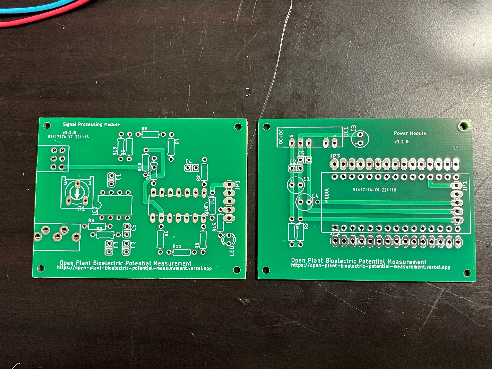
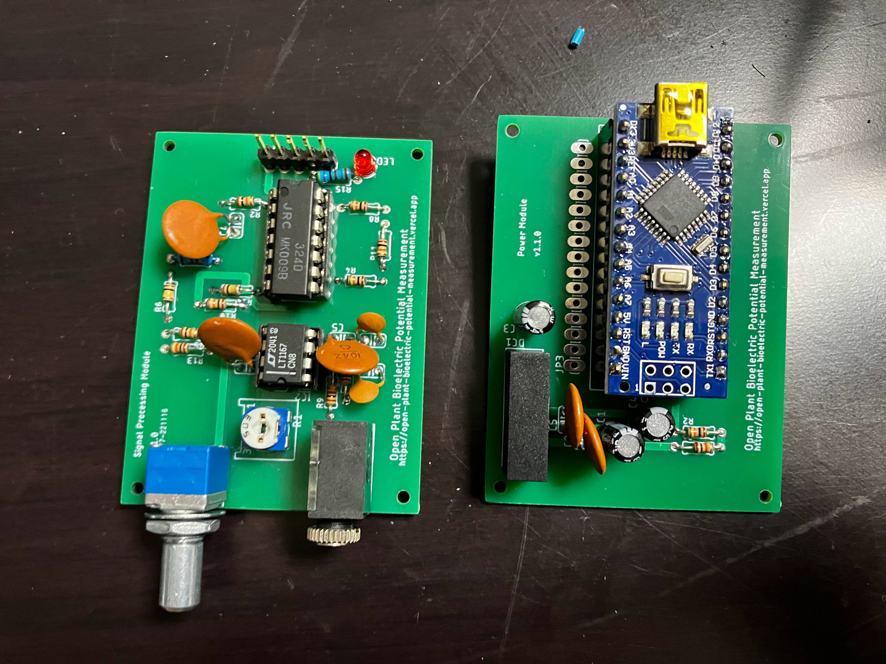
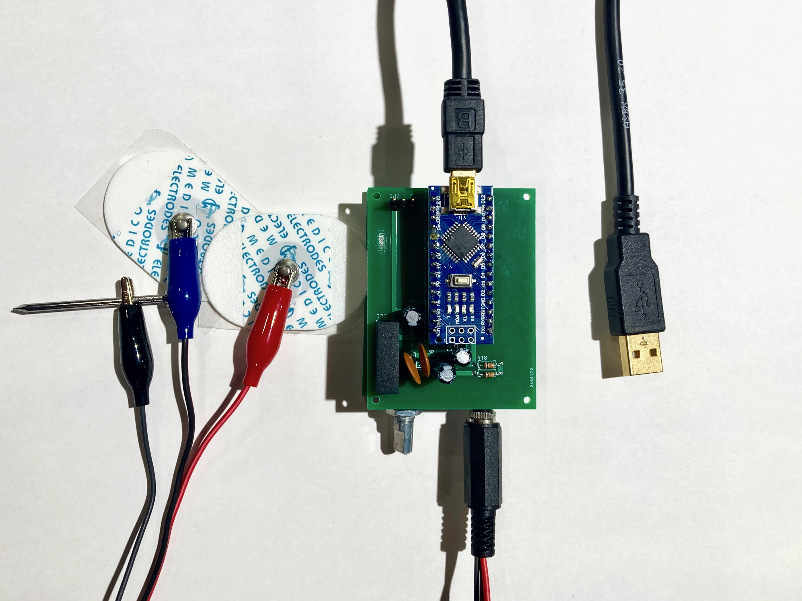

[日本語](https://github.com/kiyu-git/Plant-Bioelectric-Potential-Sensor) | [English](/README-en.md)

# Plant Bioelectric Potential Sensor

Plant Bioelectric Potential Sensor

## Overview

This repository contains the circuit diagram and other information on the developed plant bioelectric potential sensor. The plant biopotential analyzer consists of a power supply/ADC module and a signal processing module.
Signal processing diagrams and design principles are summarized [here (Japanese)](https://docs.google.com/presentation/d/1Tm0e-mBNrTchN6YlGpvvomUZfy79yOtrTSNHG-l_jFg/edit#slide=id.g15184a93673_0_74).

This repository is part of the ["Open Plant Bioelectric Potential Measurement Project (Japanese)"](https://docs.google.com/presentation/d/1Tm0e-mBNrTchN6YlGpvvomUZfy79yOtrTSNHG-l_jFg/edit?usp=sharing).

You can donate to the project or purchase a set of PCB substrates and parts [here](https://kiyu-shop.booth.pm/items/4141049).
Donations are highly appreciated to help sustain the project.

**Power supply・ADC module**

- [circuit](https://github.com/kiyu-git/Plant-Bioelectric-Potential-Sensor/tree/main/Power%20and%20ADC%20Module/images)
- [Eagle project file](https://github.com/kiyu-git/Plant-Bioelectric-Potential-Sensor/tree/main/Power%20and%20ADC%20Module/Eagle)

**Signal processing module**

- [circuit](https://github.com/kiyu-git/Plant-Bioelectric-Potential-Sensor/tree/main/Signal%20Processing%20Module/images)
- [Eagle project file](https://github.com/kiyu-git/Plant-Bioelectric-Potential-Sensor/tree/main/Signal%20Processing%20Module/Eagle)

 
 
 

## Revision history

### v1.0.0

- first model
- [link](https://github.com/kiyu-git/Plant-Bioelectric-Potential-Sensor/tree/main/archive/v1.0)

### v1.1.0

- Renumbering of parts
- [link](https://github.com/kiyu-git/Plant-Bioelectric-Potential-Sensor/tree/1f7dd3a86559b1f9ea93b5415610122e70b9b8db)

### v1.1.1

- Signal Processing Module
  - re-drawings Schematic
  - Changed the value of some resistors

## Requirement

List of parts required for assembly of Plant Bioelectric Potential Sensor.

※ The part numbers differ depending on the version. If the LED on the board of the signal processing module is printed as LED2, please refer to [here](./archive/v1.0/README.md).

**Signal Processing Module**

| Part | device name               | Value / Type | Note                                                                           |
| ---- | ------------------------- | ------------ | ------------------------------------------------------------------------------ |
| R1   | semi-fixed resistance     | 50k          |                                                                                |
| R2   | resistance                | 10k          |                                                                                |
| R3   | resistance                | 1k           |                                                                                |
| R4   | resistance                | 10k          |                                                                                |
| R5   | resistance                | 10k          |                                                                                |
| R6   | resistance                | 100k         |                                                                                |
| R7   | resistance                | 68k          |                                                                                |
| R8   | resistance                | 10k          |                                                                                |
| R9   | resistance                | 1k           |                                                                                |
| R10  | resistance                | 10k          |                                                                                |
| R11  | resistance                | 10k          |                                                                                |
| R12  | resistance                | 1k           |                                                                                |
| R13  | resistance                | 10k          |                                                                                |
| R14  | resistance                | 100k         |                                                                                |
| R15  | resistance                | 4.7k         |                                                                                |
| R16  | double potentiometer      | 50k          | [ref.](https://akizukidenshi.com/catalog/g/gP-12578/)                          |
| R16  | knob                      |              |                                                                                |
| C1   | ceramic capacitors        | 0.1u         |                                                                                |
| C2   | ceramic capacitors        | 47p          |                                                                                |
| C3   | ceramic capacitors        | 47p          |                                                                                |
| C4   | ceramic capacitors        | 0.1u         |                                                                                |
| C5   | ceramic capacitors        | 0.1u         |                                                                                |
| IC1  | operational amplifier     | LM324        | [ref.](https://akizukidenshi.com/catalog/g/gI-14055/)                          |
| IC1  | IC socket                 | 14P          |                                                                                |
| IC2  | instrumentation amplifier | LT1167       | [ref.](https://akizukidenshi.com/catalog/g/gI-02789/)                          |
| IC2  | IC socket                 | 8P           |                                                                                |
| JP1  | pin header（male）        | 5P           | Taller ones recommended. [ref.](https://akizukidenshi.com/catalog/g/gC-09056/) |
| LED  | 3mm red LED               |              |                                                                                |
| U1   | 3.5mm stereo mini jack    | MJ-354W-SG   | [ref.](https://akizukidenshi.com/catalog/g/gC-15403/)                          |

**Power Supply Module**

| Part   | device name            | Value / Type | Note                                                                                                                            |
| ------ | ---------------------- | ------------ | ------------------------------------------------------------------------------------------------------------------------------- |
| R1     | resistance             | 10k          |                                                                                                                                 |
| R2     | resistance             | 10k          |                                                                                                                                 |
| C1     | electrolytic capacitor | 47u          |                                                                                                                                 |
| C2     | ceramic capacitors     | 0.1u         |                                                                                                                                 |
| C3     | electrolytic capacitor | 47u          |                                                                                                                                 |
| C4     | electrolytic capacitor | 47u          |                                                                                                                                 |
| C5     | ceramic capacitors     | 0.1u         |                                                                                                                                 |
| DC1    | DC-DC converter        | MAU106       | [ref.](https://akizukidenshi.com/catalog/g/gM-04133/)                                                                           |
| JP1    | pin header（female）   | 5P           |                                                                                                                                 |
| MODULE | Arduino                | Nano         | write [sketch](https://github.com/kiyu-git/Plant-Bioelectric-Potential-Sensor/tree/main/Arduino%20Sketch/ADC_Serial_sender_1ch) |
| MODULE | pin header（female）   | 15P          |                                                                                                                                 |
| MODULE | pin header（female）   | 15P          |                                                                                                                                 |
| MODULE | USB Cable for Arduino  |              |                                                                                                                                 |

**Measurement Cable**

| Device Name            | Value / Type | Need | Note                                                               |
| ---------------------- | ------------ | ---- | ------------------------------------------------------------------ |
| 3.5mm stereo mini plug | MP319        | 1    |                                                                    |
| wire                   | ~ 50cm       | 3    | Easy to recognize if there are three colors: red, blue, and black. |
| alligator clip         | small        | 3    | Easy to recognize if there are three colors: red, blue, and black. |
| nail                   |              | 1    | conductive one                                                     |
| electrode pad          |              | 2    | Diversion of ECG pads, etc.                                        |

**Acrylic Box**
| Device Name | Value / Type | Need | Note |
| --- | --- | --- | --- |
| acrylic parts | 2mm thick | 1 set | for 6 sides |
| nylon screw | M2*5mm | 4 | 6mm is acceptable, for fixing bottom panel |
| nylon screw | M2*5mm | 4 | 5mm to 12mm is acceptable, for fixing the top panel |
| spacer | M2*6+6mm | 4 | between bottom panel and signal processing module |
| spacer | M2*15+6mm | 4 | between signal processing module and power supply module|
| spacer | M2\*20mm | 4 | between power module and top panel|

## Usage

This repository is a part of ["Open Plant Bioelectric Potential Measurement Project."](https://docs.google.com/presentation/d/1Tm0e-mBNrTchN6YlGpvvomUZfy79yOtrTSNHG-l_jFg/edit?usp=sharing)

In combination with the following repositories associated with the project, it is possible to measure plant bioelectric potential.

- Plant Bioelectric Potential Sensor : https://github.com/kiyu-git/Plant-Bioelectric-Potential-Sensor
- Measurement Application : https://github.com/kiyu-git/Arduino-Serial-Plot-Recorder
- Analyze Application : https://github.com/kiyu-git/Arduino-Sensor-Data-Viewer
- Automation of lighting : https://github.com/kiyu-git/Arduino-Python-Serial-Control-Example

For more information on measuring plant bioelectric potential, please click [here](https://docs.google.com/presentation/d/1Tm0e-mBNrTchN6YlGpvvomUZfy79yOtrTSNHG-l_jFg/edit#slide=id.g15184a93673_0_264).

Example of plant bioelectric potential measurement

## Reference

- Forest Symphony: [https://special.ycam.jp/interlab/projects/forestsymphony.html](https://special.ycam.jp/interlab/projects/forestsymphony.html)
- LT1167 DataSheet: https://www.analog.com/media/en/technical-documentation/data-sheets/1167fc.pdf
- [and more...](https://docs.google.com/presentation/d/1Tm0e-mBNrTchN6YlGpvvomUZfy79yOtrTSNHG-l_jFg/edit#slide=id.g148acf8fd66_1_54)

## Donation

You can donate to the project from [here](https://kiyu-shop.booth.pm/items/4141049).

Donations are highly appreciated to help sustain the project.

## Author

If you have any question, please write [issues](https://github.com/kiyu-git/Plant-Bioelectric-Potential-Sensor/issues) or contact from twitter.

twitter: https://twitter.com/kyu_yukirinrin

website: https://untamable.work

## License

[GPL-3.0 license](https://github.com/kiyu-git/Plant-Bioelectric-Potential-Sensor/blob/main/LICENSE)

If you wish to use our works for commercial purposes, please contact us via twitter DM or our website.
