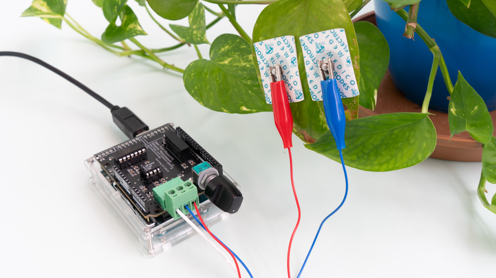

# Plant Bioelectric Potential Sensor

## Overview

This repository provides circuit diagrams and other documentation for the developed Plant Bioelectric Potential Sensor.

This repository is part of the “[Open Plant Bioelectric Potential Measurement Project](https://open-plant-bioelectric-potential-measurement.vercel.app).”

You can support the project through donations or purchase PCB boards and parts sets [here](https://kiyu-shop.booth.pm).

 

## Revision History

### v1.0.0

- Initial model

### v1.1.0

- Reassigned component numbers
- [Link](https://github.com/kiyu-git/Plant-Bioelectric-Potential-Sensor/tree/1f7dd3a86559b1f9ea93b5415610122e70b9b8db)

### v1.1.1

- Signal processing module
  - Polished the circuit diagram
  - Adjusted resistance values for some components

### v2.0

- Enhanced expandability by aligning with the Arduino shield standard
- Made significant changes to the circuit design

### v2.1

- Changed the DC-DC converter from MAU106 to MAU108
  - Enabled measurements within the full range of the Arduino ADC (0–5V)

## Requirements

List of components required to assemble the Plant Bioelectric Potential Sensor

**Measurement Board**

Refer to the circuit diagram.

**Measurement Cables**

| Device Name        | Value / Type | Quantity | Notes                                                       |
| ------------------ | ------------ | -------- | ----------------------------------------------------------- |
| Euroblock Terminal |              | 1        |                                                             |
| Wire               | ~50 cm       | 3        | Using red, blue, and black wires is recommended for clarity |
| Alligator Clips    | Small        | 3        | Using red, blue, and black clips is recommended for clarity |
| Nail               |              | 1        | Must be conductive                                          |
| Electrode Pads     |              | 2        | ECG pads or similar can be used                             |

## Usage

This repository is part of the “[Open Plant Bioelectric Potential Measurement Project](https://open-plant-bioelectric-potential-measurement.vercel.app).”

### Example of Plant Bioelectric Potential Measurement

<iframe width="560" height="315" src="https://www.youtube.com/embed/kBemMpVNFAs?si=k8SLGgCpc5z7__u_" title="YouTube video player" frameborder="0" allow="accelerometer; autoplay; clipboard-write; encrypted-media; gyroscope; picture-in-picture; web-share" referrerpolicy="strict-origin-when-cross-origin" allowfullscreen></iframe>

## References

- Forest Symphony: [https://special.ycam.jp/interlab/projects/forestsymphony.html](https://special.ycam.jp/interlab/projects/forestsymphony.html)
- LT1167 DataSheet: https://www.analog.com/media/en/technical-documentation/data-sheets/1167fc.pdf
- [And more...](https://docs.google.com/presentation/d/1Tm0e-mBNrTchN6YlGpvvomUZfy79yOtrTSNHG-l_jFg/edit#slide=id.g148acf8fd66_1_54)

## Donation

You can support the project through donations [here](https://kiyu-shop.booth.pm/items/4141049).

## Author

For inquiries, contact via Twitter or [Issues](https://github.com/kiyu-git/Plant-Bioelectric-Potential-Sensor/issues).

Twitter: https://twitter.com/kyu_yukirinrin

Website: https://untamable.work

## License

[GPL-3.0 license](https://github.com/kiyu-git/Plant-Bioelectric-Potential-Sensor/blob/main/LICENSE)

※ We also welcome collaborative research and project requests. Please contact us via Twitter DM or the website.
