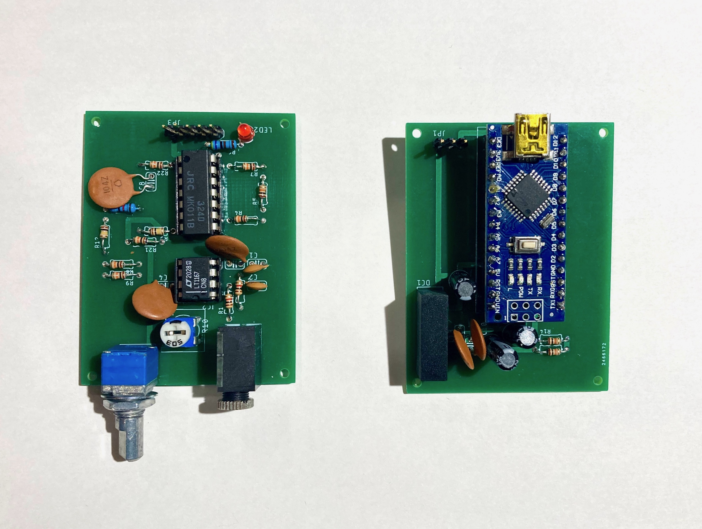

# Plant Bioelectric Potential Sensor

植物生体電位測定器

## Overview

開発した植物生体電位測定器の回路図等をまとめています。植物生体電位測定器は電源・ADC モジュールと信号処理モジュールから構成されています。
信号処理ダイアグラムや設計方針については[こちら](https://docs.google.com/presentation/d/1Tm0e-mBNrTchN6YlGpvvomUZfy79yOtrTSNHG-l_jFg/edit#slide=id.g15184a93673_0_74)にまとまっています。

なお、このリポジトリは、『[植物生体電位測定をオープンにするプロジェクト](https://docs.google.com/presentation/d/1Tm0e-mBNrTchN6YlGpvvomUZfy79yOtrTSNHG-l_jFg/edit?usp=sharing)』の一部です。

[こちら](https://kiyu-shop.booth.pm/items/4141049)de PCB 基盤およびパーツのセットを販売しています。

**電源・ADC モジュール**

- [回路図](https://github.com/kiyu-git/Plant-Bioelectric-Potential-Sensor/tree/main/Power%20and%20ADC%20Module/images)
- [Eagle ファイル](https://github.com/kiyu-git/Plant-Bioelectric-Potential-Sensor/tree/main/Power%20and%20ADC%20Module/Eagle)
- [CAM ファイル](https://github.com/kiyu-git/Plant-Bioelectric-Potential-Sensor/tree/main/Power%20and%20ADC%20Module/CAMOutputs_power_module/GerberFiles)

**信号処理モジュール**

- [回路図](https://github.com/kiyu-git/Plant-Bioelectric-Potential-Sensor/tree/main/Signal%20Processing%20Module/images)
- [Eagle ファイル](https://github.com/kiyu-git/Plant-Bioelectric-Potential-Sensor/tree/main/Signal%20Processing%20Module/Eagle)
- [CAM ファイル](https://github.com/kiyu-git/Plant-Bioelectric-Potential-Sensor/tree/main/Signal%20Processing%20Module/CAMOutputs_sp_module/GerberFiles)

 
 
 

## Requirement

植物生体電位測定器の組み立てに必要な部品一覧

| 測定モジュール |       |                                       |                                                       |
| -------------- | ----- | ------------------------------------- | ----------------------------------------------------- |
| Part           | Value | 備考                                  | URL                                                   |
| C1             | 0.1u  |                                       |                                                       |
| C2             | 47p   |                                       |                                                       |
| C3             | 47p   |                                       |                                                       |
| C4             | 0.1u  |                                       |                                                       |
| C5             | 0.1u  |                                       |                                                       |
| IC1            |       | LM324                                 | [参考](https://akizukidenshi.com/catalog/g/gI-14055/) |
| IC2            |       | LT1167                                | [参考](https://akizukidenshi.com/catalog/g/gI-02789/) |
| JP1            |       | 5 連 pinheader（背が高いの推奨）      |                                                       |
| LED            |       | 3mm LED（赤）                         |                                                       |
| R1             | 50k   | 半固定抵抗                            |                                                       |
| R2             | 10k   |                                       |                                                       |
| R3             | 1k    |                                       |                                                       |
| R4             | 10k   |                                       |                                                       |
| R5             | 10k   |                                       |                                                       |
| R6             | 100k  |                                       |                                                       |
| R7             | 68k   |                                       |                                                       |
| R8             | 10k   |                                       |                                                       |
| R9             | 1k    |                                       |                                                       |
| R10            | 10k   |                                       |                                                       |
| R11            | 10k   |                                       |                                                       |
| R12            | 1k    |                                       |                                                       |
| R13            | 10k   |                                       |                                                       |
| R14            | 100k  |                                       |                                                       |
| R15            | 4.7k  |                                       |                                                       |
| R16            | 50k   | 2 連ボリューム                        | [参考](https://akizukidenshi.com/catalog/g/gP-12578/) |
| U1             |       | 3.5mm ステレオミニジャック MJ-354W-SG | [参考](https://akizukidenshi.com/catalog/g/gC-15403/) |

| 電源モジュール |       |                                                                                                                                                     |                                                       |
| -------------- | ----- | --------------------------------------------------------------------------------------------------------------------------------------------------- | ----------------------------------------------------- |
| Part           | Value | 備考                                                                                                                                                | URL                                                   |
| C1             | 47u   |                                                                                                                                                     |                                                       |
| C2             | 0.1u  |                                                                                                                                                     |                                                       |
| C3             | 47u   |                                                                                                                                                     |                                                       |
| C4             | 47u   |                                                                                                                                                     |                                                       |
| C5             | 0.1u  |                                                                                                                                                     |                                                       |
| DC1            |       | IN 5v/ OUT ±5v DC-DC コンバーター（MAU106）                                                                                                         | [参考](https://akizukidenshi.com/catalog/g/gM-04133/) |
| JP1            |       | 5 連 pinheader（背が高いの推奨）                                                                                                                    |                                                       |
| JP2            |       | ※必要なし                                                                                                                                           |                                                       |
| MODULE         |       | Arduino Nano, [スケッチ](https://github.com/kiyu-git/Plant-Bioelectric-Potential-Sensor/tree/main/Arduino%20Sketch/ADC_Serial_sender_1ch)を書き込む |                                                       |
| R1             | 10k   |                                                                                                                                                     |                                                       |
| R2             | 10k   |                                                                                                                                                     |                                                       |

| 測定用銅線 |       |                          |     |
| ---------- | ----- | ------------------------ | --- |
| Part       | Value | 備考                     | URL |
|            |       | 3.5mm ステレオミニプラグ |     |
|            |       | 銅線（3 本）             |     |
|            |       | ワニ口クリップ（3 個）   |     |

## Usage

このリポジトリは、『[植物生体電位測定をオープンにするプロジェクト](https://docs.google.com/presentation/d/1Tm0e-mBNrTchN6YlGpvvomUZfy79yOtrTSNHG-l_jFg/edit?usp=sharing)』の一部です。

『[植物生体電位測定をオープンにするプロジェクト](https://docs.google.com/presentation/d/1Tm0e-mBNrTchN6YlGpvvomUZfy79yOtrTSNHG-l_jFg/edit?usp=sharing)に関連する以下のリポジトリと組み合わせることによって、植物生体電位を測定することが可能です。

- 植物生体電位解析器 : https://github.com/kiyu-git/Plant-Bioelectric-Potential-Sensor
- 測定アプリケーション : https://github.com/kiyu-git/-Arduino-Serial-Plot-Recorder
- 解析アプリケーション : https://github.com/kiyu-git/Arduino-Sensor-Data-Viewer
- 照明スイッチの自動化 : https://github.com/kiyu-git/Arduino-Python-Serial-Control-Example

植物生体電位の測定の詳細については[こちら](https://docs.google.com/presentation/d/1Tm0e-mBNrTchN6YlGpvvomUZfy79yOtrTSNHG-l_jFg/edit#slide=id.g15184a93673_0_264)を参考にしてください。

植物生体電位測定の例

## Reference

- Forest Symphony: [https://special.ycam.jp/interlab/projects/forestsymphony.html](https://special.ycam.jp/interlab/projects/forestsymphony.html)
- Pulsum-Plantae: [https://github.com/Lessnullvoid/Pulsum-Plantae](https://github.com/Lessnullvoid/Pulsum-Plantae)
- [and more...](https://docs.google.com/presentation/d/1Tm0e-mBNrTchN6YlGpvvomUZfy79yOtrTSNHG-l_jFg/edit#slide=id.g148acf8fd66_1_54)

## Author

質問等は twitter または[Issues](https://github.com/kiyu-git/Plant-Bioelectric-Potential-Sensor/issues)より

twitter: https://twitter.com/kyu_yukirinrin

website: https://untamable.work

## Licence

[MIT](https://github.com/kiyu-git/Plant-Bioelectric-Potential-Sensor/blob/main/LICENSE)
