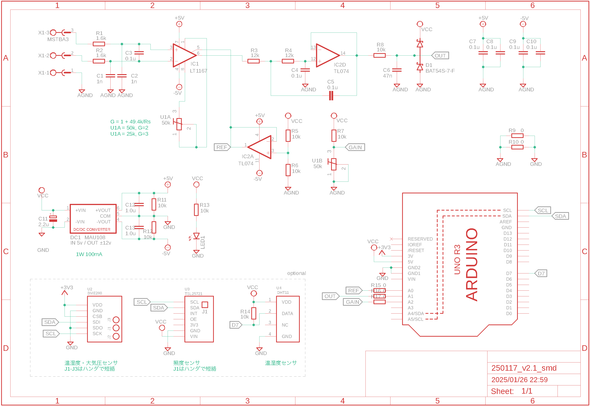
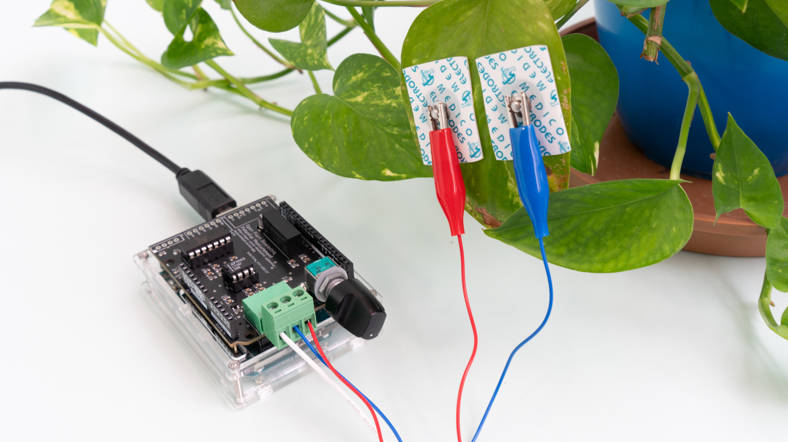
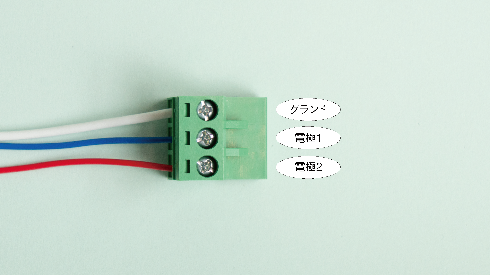

[日本語](https://github.com/kiyu-git/Plant-Bioelectric-Potential-Sensor) | [English](/README-en.md)

# Plant Bioelectric Potential Sensor

植物生体電位測定器

## Overview

開発した植物生体電位測定器の回路図等をまとめています。

なお、このリポジトリは、『[植物生体電位測定をオープンにするプロジェクト](https://open-plant-bioelectric-potential-measurement.vercel.app)』の一部です。

[こちら](https://kiyu-shop.booth.pm)からプロジェクトへの寄付、PCB 基板およびパーツのセットの購入ができます。

 

## Revision history

### v1.0.0

- 最初のモデル

### v1.1.0

- 部品の番号を振り直し
- [リンク](https://github.com/kiyu-git/Plant-Bioelectric-Potential-Sensor/tree/1f7dd3a86559b1f9ea93b5415610122e70b9b8db)

### v1.1.1

- 信号処理モジュール
  - 回路図を清書
  - 一部の抵抗の値を変更

### v2.0

- Arduino シールド規格に合わせ、拡張性を高めた。
- 回路構成の大幅な変更をおこなった。

### v2.1

- DC-DC コンバータを MAU 106 から MAU108 に変更
  - Arduino の ADC のフルレンジ（0 - 5V）での測定が可能になった。

## Requirement

植物生体電位測定器の組み立てに必要な部品一覧

**測定基板**

回路図から読み取ってください

**測定用ケーブル**

| Device Name              | Value / Type | Need | Note                              |
| ------------------------ | ------------ | ---- | --------------------------------- |
| ユーロブロックターミナル |              | 1    |                                   |
| 導線                     | ~ 50cm       | 3    | 赤青黒の 3 色があるとわかりやすい |
| みの虫クリップ           | small        | 3    | 赤青黒の 3 色があるとわかりやすい |
| 釘                       |              | 1    | 導電性のもの                      |
| 電極パッド               |              | 2    | 心電パッドなどを流用              |

## Usage

このリポジトリは、『[植物生体電位測定をオープンにするプロジェクト](https://open-plant-bioelectric-potential-measurement.vercel.app)』の一部です。

[植物生体電位測定の例 (YouTube)](https://www.youtube.com/embed/kBemMpVNFAs?si=k8SLGgCpc5z7__u_)

## Reference

- Forest Symphony: [https://special.ycam.jp/interlab/projects/forestsymphony.html](https://special.ycam.jp/interlab/projects/forestsymphony.html)
- LT1167 DataSheet: https://www.analog.com/media/en/technical-documentation/data-sheets/1167fc.pdf
- [and more...](https://docs.google.com/presentation/d/1Tm0e-mBNrTchN6YlGpvvomUZfy79yOtrTSNHG-l_jFg/edit#slide=id.g148acf8fd66_1_54)

## Donation

[こちら](https://kiyu-shop.booth.pm/items/4141049)からプロジェクトへの寄付ができます。

## Author

質問等は twitter または[Issues](https://github.com/kiyu-git/Plant-Bioelectric-Potential-Sensor/issues)より

twitter: https://twitter.com/kyu_yukirinrin

website: https://untamable.work

## License

[GPL-3.0 license](https://github.com/kiyu-git/Plant-Bioelectric-Potential-Sensor/blob/main/LICENSE)

※ 共同研究や、案件依頼・相談も受け付けております。twitter DM または website よりご連絡ください。
